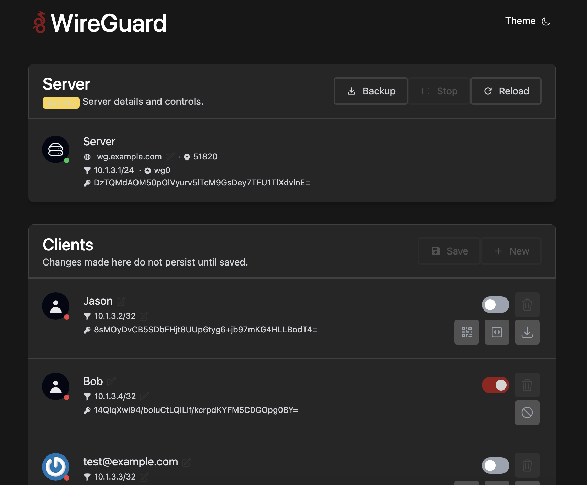

# WireGuard Zero


A WireGuard UI with zero extra configuration. Fork of "the easiest way to install & manage WireGuard" project `wg-easy`!

<p align="center">
  
</p>

## Features

* Zero-extra configuration. Clone it, install it, run it.
  * Easy migration from an unmanaged configuration.
  * Alternatively, Docker All-in-one: WireGuard + Web UI.
* Easy installation, simple to use.
* List, create, edit, delete clients.
* Connection statistics for connected clients.
* Configurable private key retention.
* Read-only mode.
* Simple manual configuration when editing `wg0.conf` directly.

## Requirements

* A host with a kernel that supports WireGuard (all modern kernels).
* A host with Docker installed.

## Installation

### The Docker Way

#### 1. Install Docker

If you haven't installed Docker yet, install it by running:

```bash
$ curl -sSL https://get.docker.com | sh
$ sudo usermod -aG docker $(whoami)
$ exit
```

And log in again.

#### 2. Run WireGuard Zero

To automatically install & run wg-zero, simply run:

<pre>
$ docker run \
    --name=wg-zero \
    -p 51820:51820/udp \
    -e WG_PORT=51820 \
    -p 51821:51821/tcp \
    -e PORT=51821 \
    -v $PWD/mount/wireguard:/etc/wireguard \
    -e WG_HOST=$(curl checkip.amazonaws.com) \
    -e PASSWORD="your_secure_password_here!!" \
    --cap-add=NET_ADMIN \
    --cap-add=SYS_MODULE \
    --sysctl=net.ipv4.ip_forward=1 \
    --sysctl=net.ipv4.conf.all.src_valid_mark=1 \
    --sysctl net.ipv6.conf.all.disable_ipv6=0 \
    --restart unless-stopped \
    jasoryeh/wg-zero
</pre>

> 💡 If your want to manually specify the server's public IP Address, replace `$(curl checkip.amazonaws.com) with a public facing IP address, a public domain pointing to the server, or a Dynamic Domain pointed at this server.
>
> 💡  Replace `your_secure_password_here!!` with a different password!

The Web UI will now be available on `http://0.0.0.0:51821`.

### For Existing Servers

#### 1. Clone It
Clone this repo!
```bash
git clone https://github.com/jasoryeh/wg-zero.git && cd wg-zero
```

#### 2. Install It
```bash
npm install
```

#### 3. Run It
```bash
bash ./start.sh
```

That's it! See below or `server/config.js` for configurable options you can use to run WireGuard Zero.

## Options

These options can be configured by setting environment variables using `-e KEY="VALUE"` in the `docker run` command.

| Env | Default | Example | Description |
| - | - | - | - |
| `PASSWORD` | - | `foobar123` | When set, requires a password when logging in to the Web UI. |
| `WG_HOST` | - | `vpn.myserver.com` | The public hostname of your VPN server. |
| `WG_PORT` | `51820` | `12345` | The UDP port the actual Wireguard VPN server will listen to. |
| `PORT` | `51821` | `12345` | The port on which the Wireguard GUI will listen to. |
| `WG_INTERFACE` | `wg0` | `wg0` | Manually specify the interface name for the Wireguard server. |
| `WG_INTERNET_INTERFACE` | `eth0` | `eth0` | Manually specify the network interface that this application will attempt to configure for use with the Wireguard VPN server. This may be needed if you use a different network mode that just forwarding the port, such as `host`. |
| `WG_ADDRESS_SPACE` | `10.1.3.1/24` | `10.1.1.1/24` | Specify the address space that clients should use. |
| `WG_PRE_UP` | `...` | - | See [config.js](https://github.com/jasoryeh/wg-zero/blob/master/server/config.js#L19) for the default value. |
| `WG_POST_UP` | `...` | `iptables ...` | See [config.js](https://github.com/jasoryeh/wg-zero/blob/master/server/config.js#L20) for the default value. |
| `WG_PRE_DOWN` | `...` | - | See [config.js](https://github.com/WeeJeWel/wg-zero/blob/master/server/config.js#L27) for the default value. |
| `WG_POST_DOWN` | `...` | `iptables ...` | See [config.js](https://github.com/jasoryeh/wg-zero/blob/master/server/config.js#L28) for the default value. |

... to be reimplemented:

| Env | Default | Example | Description |
| - | - | - | - |
| `WG_MTU` | `null` | `1420` | The MTU the clients will use. Server uses default WG MTU. |
| `WG_PERSISTENT_KEEPALIVE` | `0` | `25` | Value in seconds to keep the "connection" open. If this value is 0, then connections won't be kept alive. |
| `WG_DEFAULT_DNS` | `1.1.1.1` | `8.8.8.8, 8.8.4.4` | (WIP) DNS server clients will use. |
| `WG_ALLOWED_IPS` | `0.0.0.0/0, ::/0` | `192.168.15.0/24, 10.0.1.0/24` | (WIP) Allowed IPs clients will use. |

> If you change `WG_PORT`, make sure to also change the exposed port.

## Updating

To update to the latest version on Docker, simply run:
```bash
docker stop wg-zero
docker rm wg-zero
docker pull jasoryeh/wg-zero
```
And then run the `docker run -d \ ...` command above again.

To update to the latest version without Docker:
```bash
git pull 
```
Then run your `start.sh` script again!


## Contributor Brief
This section is intended as a briefing for contributors looking to contribute to this repository at `jasoryeh/wg-zero`.

### Notes
This is a primarily Javascript application. The goal of this project is to provide the easiest UI to add to a WireGuard server.

### Structure
This repository contains two components of wg-zero, the web component and the server component. 
There are no additional configuration files, any additional information is also stored inside of the WireGuard configuration file as a comment.

To summarize without extensively elaborating: 
* the **server** component will actually (HTTP Requests -> wg-quick, wg, file IO, etc) interface with the Wireguard server; 
  * a `expressjs` node javascript application at its core
* the **web** component is purely the user interface and will attempt to perform as many operations as securely (and developmentally) feasible on the client side (essentially acting as the user entering wg commands).
  * a `vite` javascript web application at its core
* the **configuration** is solely read from `wg0.conf`
  * additional information is stored in a similar format to `Key = Value`s inside of the `.conf` file, but is prefixed with a `#!`
  * e.g. The name of peers are stored inside the `.conf` as `#!Name = Profile Name` under each peer
  * configuration stored with `#!` is found in `_meta` (metadata)

### Running
To start up this application on the host (not recommended), the following must occur (in order):
1. Both the `web` and `server` components are initialized (npm install)
2. The `web`'s web components are built and a `dist` folder exists (npx vite build)
3. The `server` now starts up (npx nodemon)

### Development
The recommended environment for developing for this repository is to develop with the server running in Docker, and `vite` watching on the `web` directory on the host.

#### Vite & WireGuard in Docker
1. In one terminal instance: `./enter_dev.sh bash` then run `cd server && npm i && npx nodemon`
2. In another instance: `cd web && npm i && npx vite`

### Full Container 
To spin up a container with both the GUI and Wireguard VPN server running, and
  additionally, have `nodemon` and `vite` running:
```
./enter_dev.sh ./dev.sh
```

### Contributions
Welcome! This fork of `wg-easy` aims to be much more flexible, feature-rich, configurable than the original repository whilst retaining it's "easy" title. All contributions are welcome!

### Fork Goals:
- Minimize external non-WireGuard configuration (maintain one configuration file as much as possible: `/etc/wireguard/wg0.conf`)

